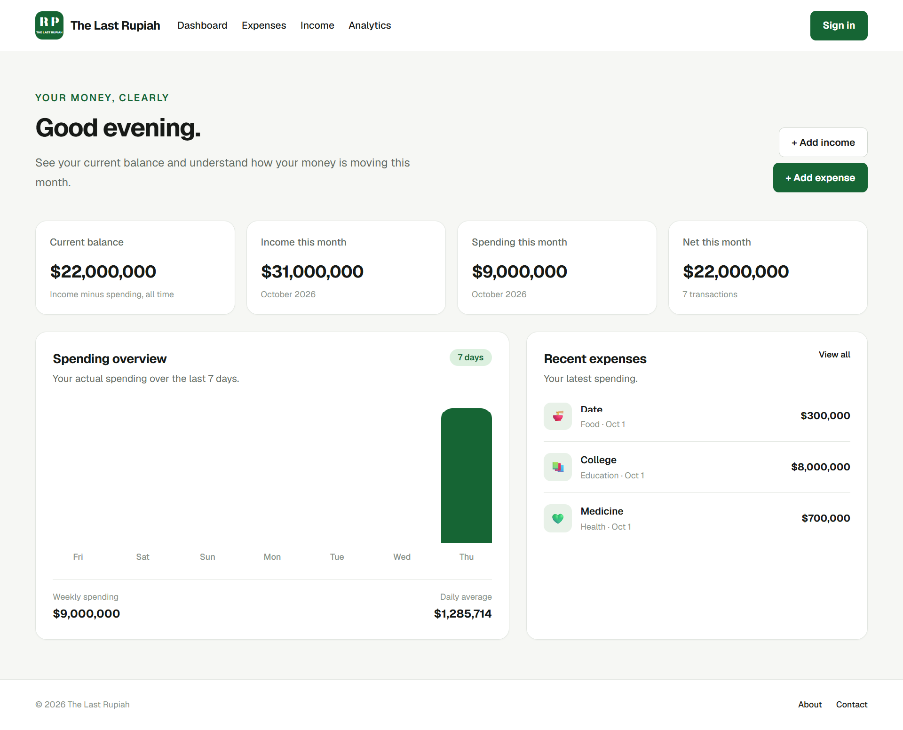

# The Last Rupiah

A personal finance tracker built to help users manage their income, expenses, and monthly balance in one place.

## Live Demo

Visit the deployed application: [The Last Rupiah](https://the-last-rupiah.vercel.app/)

## Screenshot



## Features

- **Expense Tracking** — Record and manage daily expenses.
- **Income Tracking** — Keep track of money coming in.
- **Category Management** — Organize financial transactions by category.
- **Monthly Overview** — Review income, expenses, and remaining balance.
- **Historical Analytics** — Review financial activity across different months.
- **Local Storage** — Use the application without creating an account.
- **Google Authentication** — Optionally sign in using Google.
- **Data Synchronization** — Choose whether to keep device data or account data when synchronizing.
- **Responsive Interface** — Use the application on desktop and mobile devices.

## Tech Stack

- Next.js
- React
- TypeScript
- Tailwind CSS
- Supabase
- Browser Local Storage
- Vercel

## Getting Started

### Prerequisites

- Node.js
- npm
- A Supabase project (for authentication and cloud features)

### Installation

1. Clone the repository:

   ```bash
   git clone https://github.com/adityarizal0069-lgtm/the-last-rupiah.git
   ```

2. Navigate into the project directory:

   ```bash
   cd the-last-rupiah
   ```

3. Install dependencies:

   ```bash
   npm install
   ```

4. Create a `.env.local` file in the project root and configure the required environment variables:

   ```env
   NEXT_PUBLIC_SUPABASE_URL=your_supabase_project_url
   NEXT_PUBLIC_SUPABASE_PUBLISHABLE_KEY=your_supabase_publishable_key
   SUPABASE_SERVICE_ROLE_KEY=your_supabase_service_role_key
   ```

   Keep your service role key private. Never commit real secrets to GitHub.

5. Start the development server:

   ```bash
   npm run dev
   ```

6. Open [http://localhost:3000](http://localhost:3000).

## Project Goals

The Last Rupiah was built to provide a straightforward way to track personal finances, with support for both anonymous device-based usage and optional account-based synchronization.

## Author

**Mohammad Aditya Fahrizal**

- GitHub: [@adityarizal0069-lgtm](https://github.com/adityarizal0069-lgtm)

## License

No license has been specified yet.
